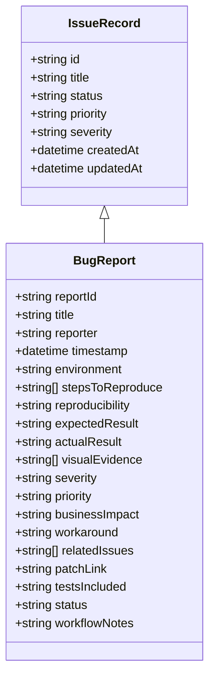
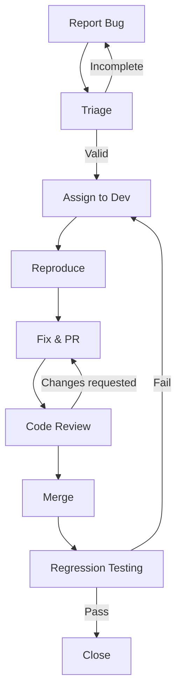
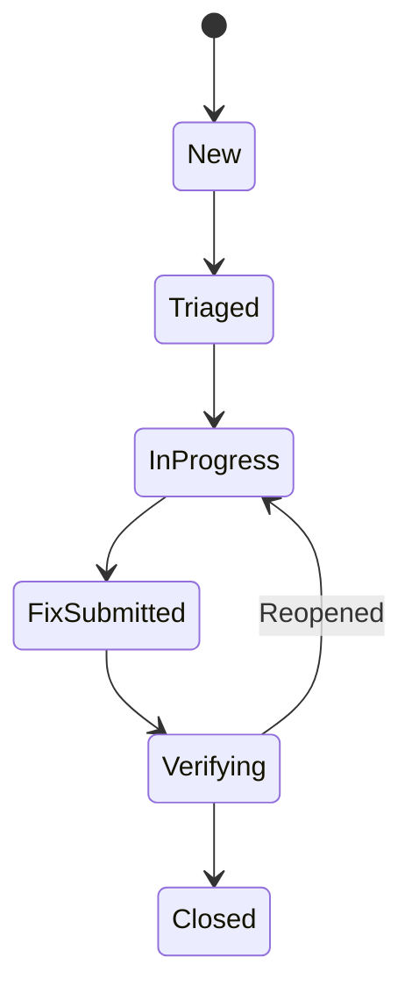
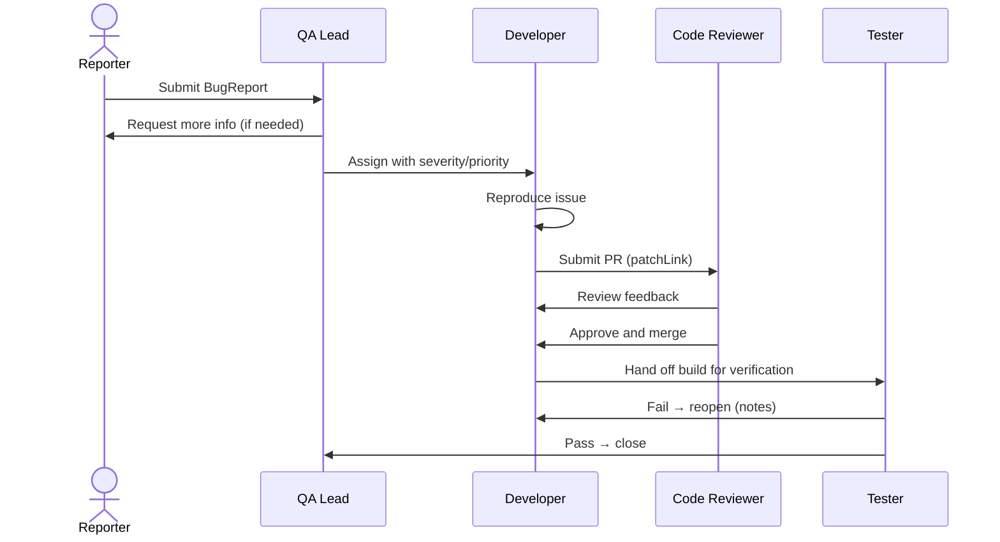

## Bug Workflow and Data Model

### BugReport UML (Mermaid)

### Bug Lifecycle Activity

### Status Workflow

### Roles and Handoffs

Use the .github/ISSUE_TEMPLATE/bug_report.yml when filing bugs to ensure complete, reproducible reports.

